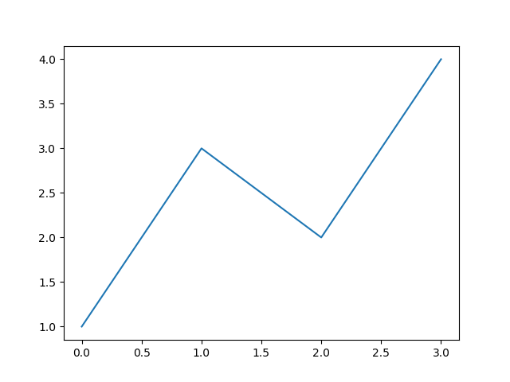
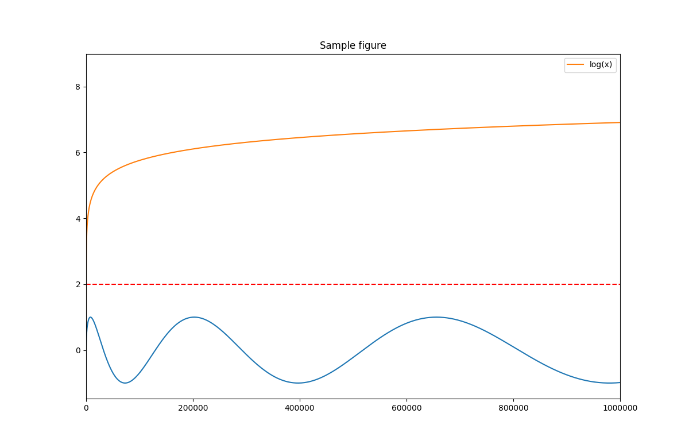
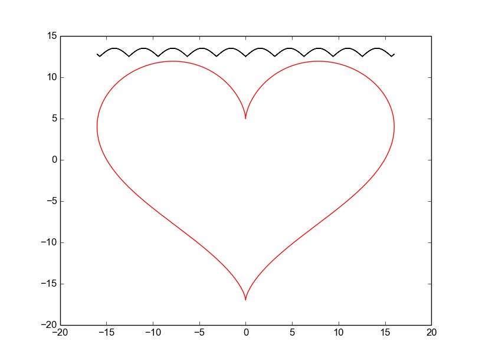
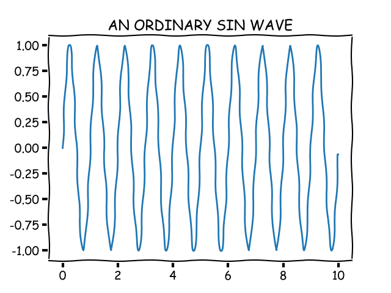
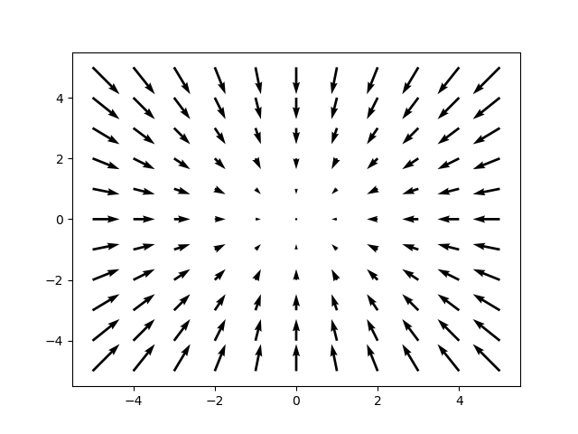
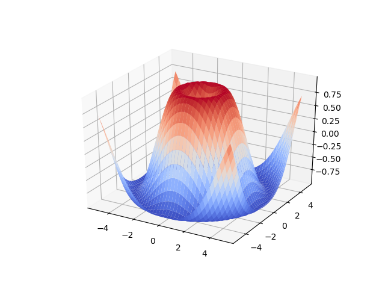

Plotter
==

A modern C++ plotting library with integrated geometry and color management, built on top of matplotlib.

**🎯 Now requires Concord Points for all coordinate data and Pigment for all colors!**
**🎬 NEW: Animated GIF support for creating smooth animations!**

Hugely inspired and initially copy/fork of [matplotlibcpp](https://github.com/lava/matplotlib-cpp)

## Key Features

- **Header-only library** - Easy integration, just `#include <plotter.hpp>`
- **Modular architecture** - Organized into logical components for better maintainability  
- **Class-based interface** - Create multiple independent plot instances simultaneously
- **Modern C++20** - Uses latest C++ features and best practices
- **Concord geometry integration** - All coordinates must use Concord Point objects
- **Pigment color management** - All colors must use Pigment RGB, HSL, or HSV types
- **🎬 Animated GIF support** - Create smooth animations using imageio or PIL for efficient GIF encoding
- **Python/matplotlib backend** - Leverages the power and flexibility of matplotlib
- **Easy to use** - Simple API focused on geometric primitives and proper color management

---

## Usage

### Complete minimal example:
```cpp
#include <plotter.hpp>

int main() {
    plotter::Plotter plt;
    
    // Create points using Concord (z defaults to 0 automatically)
    std::vector<concord::Point> points;
    points.emplace_back(1, 3);  // Point(1, 3, 0)
    points.emplace_back(2, 1);  // Point(2, 1, 0)
    points.emplace_back(3, 4);  // Point(3, 4, 0)
    points.emplace_back(4, 2);  // Point(4, 2, 0)
    
    plt.plot(points);
    plt.save("minimal.png");
    return 0;
}
```

### Enhanced example with geometry and colors:
```cpp
#include <plotter.hpp>
#include <cmath>

int main() {
    plotter::Plotter plt;
    
    // Create sine wave using Concord points
    std::vector<concord::Point> sine_points;
    for (int i = 0; i <= 100; ++i) {
        double x = i * 0.1;
        double y = std::sin(x);
        sine_points.emplace_back(x, y);  // z defaults to 0
    }
    
    // Plot with Pigment color
    plt.plot(sine_points, pigment::RGB::blue());
    
    // Create cosine wave
    std::vector<concord::Point> cosine_points;
    for (int i = 0; i <= 100; ++i) {
        double x = i * 0.1;
        double y = std::cos(x);
        cosine_points.emplace_back(x, y);
    }
    
    // Plot with different Pigment color
    plt.plot(cosine_points, pigment::RGB::red());
    
    plt.title("Sine and Cosine with Concord Points");
    plt.save("geometry_colors.png");
    return 0;
}
```

### 🎬 NEW: Animated GIF Creation:
```cpp
#include <plotter.hpp>
#include <cmath>

int main() {
    plotter::Plotter plt;
    
    // Enable animation mode with 200ms per frame
    plt.enable_animation(200);
    
    plt.xlim(0, 10);
    plt.ylim(-2, 2);
    
    // Create 20 frames of growing sine wave
    for (int frame = 1; frame <= 20; ++frame) {
        plt.clf();  // Clear previous frame
        
        std::vector<concord::Point> sine_points;
        for (int i = 0; i <= frame * 5; ++i) {
            double x = i * 0.1;
            double y = std::sin(x);
            sine_points.emplace_back(x, y);
        }
        
        plt.plot(sine_points, pigment::RGB::blue());
        plt.title("Growing Sine Wave Animation");
        // Frame automatically captured when in animation mode
    }
    
    // Save as animated GIF
    plt.save("animated_sine.gif", true);  // animation=true
    
    // Also save final frame as static image
    plt.save("final_frame.png", false);   // animation=false
    
    return 0;
}
```

---

## 🎬 Animation API Reference

### Animation Control Methods

```cpp
// Enable animation mode with frame duration
plt.enable_animation(200);              // 200ms per frame (default: 100ms)

// Check animation status
bool is_enabled = plt.is_animation_enabled();

// Get frame count
size_t frames = plt.frame_count();      // Number of captured frames

// Clear all frames
plt.clear_frames();                     // Remove all captured frames

// Disable animation
plt.disable_animation();                // Stop capturing frames

// Set frame timing
plt.set_frame_duration(150);            // 150ms per frame
```

### Save Methods with Animation Support

```cpp
// Save static image (default behavior)
plt.save("plot.png");                   // Static PNG
plt.save("plot.png", false);            // Explicitly static

// Save animated GIF
plt.save("animation.gif", true);        // Use captured frames for GIF

// Save with custom DPI
plt.save("plot.png", 300);              // 300 DPI static image
plt.save("animation.gif", 300, true);   // 300 DPI animated GIF
```

### Animation Workflow

1. **Enable Animation Mode**: `plt.enable_animation(duration_ms)`
2. **Create Frames**: Each `plot()`, `scatter()`, `bar()` call captures a frame as a temporary PNG
3. **Save GIF**: `plt.save("animation.gif", true)` combines frames using imageio/PIL
4. **Clean Up**: Temporary frame files are automatically removed after GIF creation

**Technical Note**: The library captures each frame as a high-quality PNG, then uses Python's imageio (preferred) or PIL (fallback) to combine them into an optimized animated GIF. This approach ensures excellent quality while leveraging proven, well-tested libraries for GIF encoding.

---

## 🎯 Breaking Changes in v2.0

### Coordinate System
- ❌ **OLD**: `plot(std::vector<double> x, std::vector<double> y)`
- ✅ **NEW**: `plot(std::vector<concord::Point> points)`

### Color System  
- ❌ **OLD**: String colors like `"red"`, `"blue"`
- ✅ **NEW**: `pigment::RGB::red()`, `pigment::RGB::blue()`

### Point Creation
```cpp
// ✅ Concord Points automatically set z=0 when omitted
concord::Point p1(1.0, 2.0);           // Point(1.0, 2.0, 0.0)
concord::Point p2(1.0, 2.0, 3.0);      // Point(1.0, 2.0, 3.0)

// ✅ Easy vector creation
std::vector<concord::Point> points;
points.emplace_back(1, 2);              // z defaults to 0
points.emplace_back(3, 4);              // z defaults to 0
```

Build with:
```bash
make compile
```

**Result:**



### A more comprehensive example with Concord and Pigment:
```cpp
#include <plotter.hpp>
#include <cmath>
#include <vector>

int main()
{
    // Create a plotter instance
    plotter::Plotter plt;
    
    // Create points using Concord
    std::vector<concord::Point> curve_points;
    std::vector<concord::Point> line_points;
    std::vector<concord::Point> log_points;
    
    for(int i = 1; i <= 100; ++i) {
        double x = i * i;
        curve_points.emplace_back(x, sin(2 * M_PI * i / 360.0));
        line_points.emplace_back(x, 2.0);  // Constant line at y=2
        log_points.emplace_back(x, log(i));
    }
    
    // Plot using Pigment colors
    plt.plot(curve_points, pigment::RGB::blue());
    plt.plot(line_points, pigment::RGB::red());
    plt.plot(log_points, pigment::RGB::green());
    
    // Set axis limits
    plt.xlim(0, 10000);
    
    // Add labels and title
    plt.xlabel("X Values");
    plt.ylabel("Y Values");
    plt.title("Sample figure with Concord Points and Pigment Colors");
    
    // Enable legend
    plt.legend();
    
    // Save the image
    plt.save("./basic.png");
    
    return 0;
}
```

**Result:**



### Modern C++20 syntactic sugar:
```cpp
#include <plotter.hpp>
#include <cmath>

using namespace std;

int main()
{
    // Create a plotter instance
    plotter::Plotter plt;
    
    // Prepare data
    int n = 5000;
    vector<double> x(n), y(n);
    for(int i = 0; i < n; ++i) {
        double t = 2 * M_PI * i / n;
        x[i] = 16 * sin(t) * sin(t) * sin(t);
        y[i] = 13 * cos(t) - 5 * cos(2*t) - 2 * cos(3*t) - cos(4*t);
    }

    // Plot with red line style
    plt.plot(x, y, "r-");

    plt.show();
    return 0;
}
```

**Result:**



### XKCD-styled plots:
```cpp
#include <plotter.hpp>
#include <vector>
#include <cmath>

int main() {
    // Create a plotter instance
    plotter::Plotter plt;
    
    std::vector<double> t(1000);
    std::vector<double> x(t.size());

    for(size_t i = 0; i < t.size(); i++) {
        t[i] = i / 100.0;
        x[i] = sin(2.0 * M_PI * 1.0 * t[i]);
    }

    plt.plot(t, x);
    plt.title("AN ORDINARY SIN WAVE");
    plt.save("xkcd.png");
    
    return 0;
}
```

**Result:**



### Vector field visualization:
```cpp
#include <plotter.hpp>

int main()
{
    // Create a plotter instance
    plotter::Plotter plt;
    
    // u and v are the x and y components of the arrows
    std::vector<int> x, y, u, v;
    for (int i = -5; i <= 5; i++) {
        for (int j = -5; j <= 5; j++) {
            x.push_back(i);
            u.push_back(-i);
            y.push_back(j);
            v.push_back(-j);
        }
    }

    plt.scatter(x, y);
    plt.show();
    return 0;
}
```

**Result:**



### 3D Surface plots:
```cpp
#include <plotter.hpp>

int main()
{
    // Create a plotter instance
    plotter::Plotter plt;
    
    std::vector<std::vector<double>> x, y, z;
    for (double i = -5; i <= 5; i += 0.25) {
        std::vector<double> x_row, y_row, z_row;
        for (double j = -5; j <= 5; j += 0.25) {
            x_row.push_back(i);
            y_row.push_back(j);
            z_row.push_back(std::sin(std::hypot(i, j)));
        }
        x.push_back(x_row);
        y.push_back(y_row);
        z.push_back(z_row);
    }

    plt.show();
    return 0;
}
```

**Result:**



---

## Geometry & Color Features

Plotter integrates **Concord** (geometry library) and **Pigment** (color library) for enhanced plotting capabilities:

### Concord Geometry Integration

Plot directly with geometric primitives:

```cpp
#include <plotter.hpp>

// Plot using Concord Points
std::vector<concord::Point> points;
for (int i = 0; i <= 100; ++i) {
    double x = i * 0.1;
    points.emplace_back(x, std::sin(x), 0.0);
}

plotter::Plotter plt;
plt.plot(points, pigment::RGB::red());

// Generate geometric shapes
plt.plot_circle(0.0, 0.0, 1.0, pigment::RGB::blue());
plt.plot_rectangle(1.0, -0.5, 2.0, 1.0, pigment::RGB::green());
```

### Pigment Color Management

Advanced color spaces and palette management:

```cpp
// Multiple color spaces
pigment::RGB red_color("#FF0000");
pigment::HSL purple_hsl(280, 0.8, 0.6);
pigment::HSV bright_green(120, 1.0, 1.0);

// Color palette management
std::vector<pigment::RGB> custom_colors = {
    pigment::RGB("#FF6B35"),  // Orange
    pigment::RGB("#F7931E"),  // Golden
    pigment::RGB("#FFD23F")   // Yellow
};
pigment::Palette palette(custom_colors);
plt.set_color_palette(palette);

// Automatic color cycling
auto next_color = plt.get_next_color();
plt.plot(data, next_color);
```

---

## Project Structure

The library provides a clean, single-header interface with internal modularity:

```
include/
├── plotter.hpp                 # Single public header - include this
└── plotter/
    ├── plotter.hpp             # Main implementation
    └── internal/               # Internal modules (hidden from users)
        ├── core.hpp            # Core functionality, Python interpreter setup
        ├── figure.hpp          # Figure management (show, save, clf, etc.)
        ├── axes.hpp            # Axes configuration (labels, limits, grid, etc.)
        ├── plots.hpp           # Basic plotting functions (plot, contour, etc.)
        ├── scatter.hpp         # Scatter plot functionality
        ├── charts.hpp          # Bar charts, histograms, box plots
        ├── image.hpp           # Image display and vector field plots
        └── integrations.hpp    # Concord geometry & Pigment color utilities
```

### Public API

Users only need to include the main header:

```cpp
#include <plotter.hpp>

// Access to:
// - plotter::Plotter class
// - concord::Point for geometry
// - pigment::RGB, pigment::HSL, pigment::HSV for colors
// - pigment::Palette for color management
```

### Core Functionality (`core.hpp`)
- Python interpreter management
- NumPy array conversion utilities
- Backend configuration

### Figure Management (`figure.hpp`)
- `show()` - Display plots
- `save()` - Save plots to file
- `figure()` - Create new figures
- `clf()`, `cla()` - Clear figures/axes
- `close()` - Close figures

### Axes Configuration (`axes.hpp`)
- `xlabel()`, `ylabel()` - Set axis labels
- `title()`, `suptitle()` - Set titles
- `xlim()`, `ylim()` - Set axis limits
- `legend()` - Add legends
- `grid()` - Configure grid
- `subplot()` - Create subplots

### Plotting Functions (`plots.hpp`)
- `plot()` - Line plots
- `fill()`, `fill_between()` - Filled areas
- `contour()` - Contour plots
- `plot_surface()` - 3D surface plots
- `hist()` - Histograms
- `stem()` - Stem plots

### Scatter Plots (`scatter.hpp`)
- `scatter()` - 2D and 3D scatter plots
- `scatter_colored()` - Colored scatter plots

### Charts (`charts.hpp`)
- `bar()`, `barh()` - Bar charts
- `boxplot()` - Box plots

### Image Display (`image.hpp`)
- `imshow()` - Display images
- `quiver()` - Vector field plots

### Multiple Independent Plot Instances

The class-based interface allows you to create multiple independent plot instances that can be managed separately:

```cpp
#include <plotter.hpp>
#include <cmath>
#include <vector>

int main() {
    // Create multiple independent plotter instances
    plotter::Plotter plt1;  // Will use figure 1
    plotter::Plotter plt2;  // Will use figure 2
    
    // Prepare data for different plots
    std::vector<double> x(100);
    std::vector<double> sine_y(100);
    std::vector<double> cosine_y(100);
    
    for(int i = 0; i < 100; ++i) {
        x[i] = i * 0.1;
        sine_y[i] = sin(x[i]);
        cosine_y[i] = cos(x[i]);
    }
    
    // Plot on first instance
    plt1.plot(x, sine_y, "b-");
    plt1.title("Sine Wave");
    plt1.xlabel("X");
    plt1.ylabel("sin(x)");
    plt1.save("sine_plot.png");
    
    // Plot on second instance (completely independent)
    plt2.plot(x, cosine_y, "r-");
    plt2.title("Cosine Wave");
    plt2.xlabel("X");
    plt2.ylabel("cos(x)");
    plt2.save("cosine_plot.png");
    
    // Can also create plots in a loop
    for(int i = 0; i < 3; ++i) {
        plotter::Plotter plt;  // Each gets a new figure number
        
        std::vector<double> data = {i+1.0, i+2.0, i+3.0, i+4.0};
        plt.plot(data, "o-");
        plt.title("Dataset " + std::to_string(i));
        plt.save("dataset_" + std::to_string(i) + ".png");
    }
    
    return 0;
}
```

This approach allows you to:
- Create multiple plots that don't interfere with each other
- Manage different plot configurations independently
- Generate multiple outputs in batch processing scenarios
- Build more complex applications with multiple visualization components

---

## 📁 Example Files

The `examples/` directory contains comprehensive demonstrations:

### Core Examples:
- **`simple_concord_example.cpp`** - Minimal example with Concord Points
- **`basic.cpp`** - Basic plotting with multiple series
- **`class_example.cpp`** - Multiple plotter instances
- **`concord_points_demo.cpp`** - Comprehensive Concord Points showcase

### Animation Examples:
- **`simple_gif_demo.cpp`** - Basic 5-frame GIF animation
- **`gif_animation_demo.cpp`** - Advanced 20-frame sine wave animation
- **`animation.cpp`** - Real-time plotting animation

### Advanced Examples:
- **`modern.cpp`** - Parametric plots with heart shape
- **`fill.cpp`** - Area fills and complex shapes
- **`public_api_demo.cpp`** - Clean API demonstration

Build and run any example:
```bash
make compile
./build/simple_gif_demo        # Creates simple_animation.gif
./build/gif_animation_demo     # Creates animated_sine_wave.gif
./build/simple_concord_example # Creates simple_concord_example.png
```

---

## Installation

Plotter works by wrapping the popular Python plotting library matplotlib and integrates with Concord (geometry) and Pigment (colors). This means you need a working Python installation with development headers and NumPy. **GIF animation uses imageio (preferred) or PIL as fallback - one of these is required for GIF creation.**

### Using devbox (Recommended)

This project uses [devbox](https://www.jetpack.io/devbox) for dependency management:

```bash
# Install devbox if you haven't already
curl -fsSL https://get.jetpack.io/devbox | bash

# Enter the devbox environment
devbox shell

# Build the project
make compile
```

The devbox.json file automatically provides:
- Python 3.13 with development headers
- NumPy and matplotlib for plotting
- **imageio for efficient GIF creation (preferred over PIL)**
- Concord library for geometric primitives
- Pigment library for advanced color management
- CMake and build tools

### Manual Installation

If not using devbox, install the required dependencies:

**Ubuntu/Debian:**
```bash
sudo apt-get install python3-dev python3-numpy python3-matplotlib cmake build-essential
# For GIF support (choose one):
pip install imageio          # Preferred
# OR
pip install pillow          # Alternative
```

**Python packages (if not system-installed):**
```bash
pip install numpy matplotlib imageio
```

**For GIF animation support**, install one of:
- `imageio` (preferred): `pip install imageio`
- `pillow` (fallback): `pip install pillow`

The library will automatically detect which is available and use imageio if present, falling back to PIL if needed.

The library will automatically fetch Concord and Pigment dependencies via CMake FetchContent.

### CMake Configuration

The library uses CMake with automatic Python detection:

```cmake
find_package(Python3 COMPONENTS Interpreter Development NumPy REQUIRED)
```

### Building

```bash
mkdir build && cd build
cmake .. -DPLOTTER_BUILD_EXAMPLES=ON
make
```

Or simply use the provided Makefile:
```bash
make compile
```

---

## Dependencies

- **Python 3** with development headers
- **NumPy** for array operations  
- **Matplotlib** for plotting backend
- **Concord** for geometric primitives (automatically fetched)
- **Pigment** for color management (automatically fetched)
- **CMake 3.15+** for building
- **C++20 compatible compiler**

**No additional dependencies needed for GIF animation** - handled entirely in C++!


---

## Why Plotter?

This library started as a refactoring of matplotlib-cpp to address several issues:

- **Monolithic design**: matplotlib-cpp was a single 3000+ line header file
- **Poor maintainability**: Hard to navigate and extend
- **Lack of organization**: All functionality mixed together
- **Limited geometry support**: No built-in geometric primitives
- **Basic color management**: Limited color space support

**Plotter improvements:**
- ✅ **Modular design** - Logical separation of functionality
- ✅ **Header-only** - Easy integration, just include `plotter.hpp`
- ✅ **Modern C++20** - Uses latest language features
- ✅ **Integrated geometry** - Concord library for geometric operations
- ✅ **Advanced colors** - Pigment library for RGB, HSL, HSV support
- ✅ **Clean API** - Single header exposes only what you need
- ✅ **Better documentation** - Clear API organization
- ✅ **Maintainable** - Easy to understand and extend

---

## Notes & Limitations

- **Thread safety**: This library is not thread safe due to Python interpreter limitations
- **Single interpreter**: Only one Python interpreter per process (Python limitation)
- **Memory management**: Python objects are managed internally
- **Error handling**: Exceptions are thrown for matplotlib errors

---

## Contributing

Contributions are welcome! The modular design makes it easy to:
- Add new plotting functions
- Extend existing modules  
- Improve documentation
- Add examples

## License

This project maintains the same license as matplotlib-cpp.